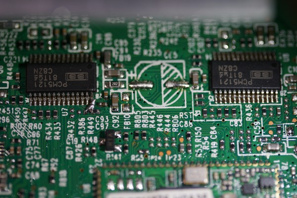

# Harman Kardon Onyx Studio 3 issue tracker

- [No sound unless a button is pressed and held](#no-sound-unless-a-button-is-pressed-and-held)
- [Stuttering](#stuttering)

## No sound unless a button is pressed and held

### Symptoms

There seems to be multiple reports on the net related to this issue, all with the following symptoms.

- Bluetooth is paired but no sound is coming out.
- AUX input is connected by no sound is coming out.
- Sound is coming out only when one of the control buttons is pressed and held.

I personally have three of this speaker, two of them exhibiting this same problem.

### Solution
This unit uses Texas Instruments PCM5121 audio DACs as seen on the following photo. Two chips are required because there are four different channels to handle. As described on the [datasheet](https://www.ti.com/product/PCM5121), this chip has XSMT pin for soft mute control. Low input value means soft mute, high input value mean soft un-mute. Quick check by connecting XSMT and DVDD pins with jumper wire causing the sound to come out. For some reason the XSMT pins wasn't getting correct value, hence the muted sound.

Quoting the datasheet, 

> In systems where XSMT is not required, it can be directly connected to AVDD.

however in my case, I use DVDD instead since it seems to work just fine. Also AVDD is too far away. That blob of solder bridging XSMT and DVDD on the left chip is the result of my lazy solution to this problem. It's not necessary to do the same on the other chip since it seems the XSMT pins are connected to each other. No side effects are observed so far.

## Stuttering

Stutters are observed when paired with the following devices.

_This list is incomplete, you can help by expanding it._

- Sony Bravia KD-55X9000E
