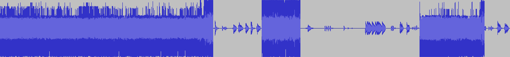

# Tinkering around with Harman Kardon Onyx Studio 3

* [Disclaimer](#disclaimer)
* [Reverse engineering notes](#reverse-engineering-notes)
  + [Hardware](#hardware)
  + [Firmware update mode](#firmware-update-mode)
  + [Firmware dump analysis](#firmware-dump-analysis)
* [Issues](#issues)
  + [No sound unless a button is pressed and held](#no-sound-unless-a-button-is-pressed-and-held)
  + [Stuttering](#stuttering)

## Disclaimer

All of the information provided on this repository is provided "AS-IS" and with no warranties. Use at your own risk.

## Reverse engineering notes

### Hardware

|               |         |
|---------------|---------|
| **MCU**       | CSR8675 |
| **BT Module** | BT875   |
| **DAC**       | PCM5121 |

### Firmware update mode

Switching from normal operation to firmware update can be done with the following steps.

1. Turn the unit on
2. Hold the `Volume -` and `Phone` buttons for 10 seconds
3. The unit will reset itself into firmware update mode

The USB device is identified as described by `lsusb` output below.

```
Bus 001 Device 005: ID 0ecb:1ebe  000A00003500
```

### Firmware dump analysis

```
$ stat -c %s firmware.bin
1881994

$ md5sum firmware.bin
d803c8ceea558bd59de9d0fd8ba08009  firmware.bin

$ binwalk firmware.bin
DECIMAL       HEXADECIMAL     DESCRIPTION
--------------------------------------------------------------------------------
0             0x0             CSR (XAP2) DFU firmware update header
1494          0x5D6           CSR Bluecore firmware segment
1098594       0x10C362        mcrypt 2.2 encrypted data, algorithm: 3-WAY, mode: CBC, keymode: 8bit
1245048       0x12FF78        YAFFS filesystem, big endian
1323404       0x14318C        YAFFS filesystem, big endian

$ dfutool verify firmware.bin
Filename	firmware.bin
Filesize	1881994
Checksum	7a872821

DFU suffix	01 00 fe ff 12 0a 00 01 55 46 44 10 21 28 87 7a

idVendor	0a12
idProduct	fffe
bcdDevice	1

bcdDFU		1.0
ucDfuSignature	DFU
bLength		16
dwCRC		7a872821

Firmware type	CSR-dfu2
Firmware check	valid checksum
```

Importing the firmware file as raw data in Audacity yields the following audio data. Imported using signed 16-bit PCM encoding, big-endian byte-ordering, single channel, and 16000 Hz sample rate.



## Issues

### No sound unless a button is pressed and held

#### Symptoms

There seems to be multiple reports on the net related to this issue, all with the following symptoms.

- Bluetooth is paired but no sound is coming out.
- AUX input is connected by no sound is coming out.
- Sound is coming out only when one of the control buttons is pressed and held.

I personally have three of this speaker, two of them exhibiting this same problem.

#### Solution
This unit uses Texas Instruments PCM5121 audio DACs as seen on the following photo. Two chips are required because there are four different channels to handle. As described on the [datasheet](https://www.ti.com/product/PCM5121), this chip has XSMT pin for soft mute control. Low input value means soft mute, high input value mean soft un-mute. Quick check by connecting XSMT and DVDD pins with jumper wire causing the sound to come out. For some reason the XSMT pins wasn't getting correct value, hence the muted sound.


Quoting the datasheet, 

> In systems where XSMT is not required, it can be directly connected to AVDD.

however in my case, I use DVDD instead since it seems to work just fine. Also AVDD is too far away. That blob of solder bridging XSMT and DVDD on the left chip is the result of my lazy solution to this problem. It's not necessary to do the same on the other chip since it seems the XSMT pins are connected to each other. No side effects are observed so far.

### Stuttering

Stutters are observed when paired with the following devices.

_This list is incomplete, you can help by expanding it._

- Sony Bravia KD-55X9000E
